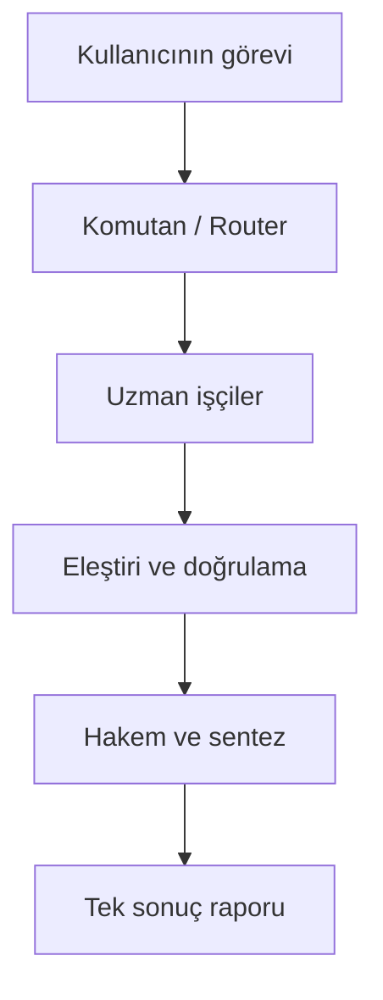

# VOLTRAN

[](https://github.com/ydnAkif/voltran/actions/workflows/ci.yml)
[](https://www.python.org/)

[](https://opensource.org/licenses/MIT)
[]()

**Birden fazla yapay zekâ modelini (Codex, Claude, Google Antigravity), tek bir görevin uzman parçaları olarak birleştiren yerel orkestrasyon sistemi.**

> **Tek Komutla Kurulum:**
> ```bash
> ./scripts/install.sh
> ```

---

## İçindekiler
- [Projenin Amacı](#projenin-amacı)
- [Temel Çalışma Biçimi ve Roller](#temel-çalışma-biçimi)
- [Çalışma Modları](#çalışma-modları)
- [Kullanım ve Komutlar](#kullanım-ve-komutlar)
  - [Sistem Teşhisi (`voltran doctor`)](#-sistem-teşhisi-voltran-doctor)
  - [Görev Yürütme (`voltran run`)](#-görev-yürütme-voltran-run)
  - [Canlı Terminal Paneli (`voltran dashboard`)](#️-canlı-terminal-gösterge-paneli-voltran-dashboard)
  - [Model Kıyaslama (`voltran bench`)](#-görev-bazlı-kıyaslama-ve-değerlendirme-voltran-bench)
  - [Geçmiş Kayıtları (`voltran history`)](#-çalışma-geçmişi-voltran-history)
  - [Yeniden Oynatma ve İptal (`voltran replay` / `cancel`)](#-yeniden-oynatma-ve-iptal-voltran-replay-voltran-cancel)
  - [Katmanlı Yapılandırma (`voltran config`)](#️-katmanlı-yapılandırma-voltran-config)
- [Tasarım İlkeleri ve Güvenlik](#tasarım-ilkeleri)
- [Yol Haritası](#yol-haritası)

---

VOLTRAN; kullanıcıdan tek bir görev alır, görevi uygun uzmanlara böler, sonuçları kontrollü turlarla karşılaştırır ve tek bir denetlenebilir cevap üretir. Amaç, üç modele aynı soruyu sorup üç ayrı cevap göstermek değil; her modeli gerçekten katkı sağlayacağı yerde kullanmaktır.


## Projenin amacı

- GPT/Codex, Claude ve Gemini ailesini ortak bir görev akışında çalıştırmak.
- Basit işleri hızlı modellere, zor işleri güçlü modellere yönlendirmek.
- Modellerin birbirlerinin sonuçlarını inceleyebilmesini sağlamak.
- Çelişkileri, kaynakları ve güven düzeyini son raporda göstermek.
- Kullanıcının mevcut ChatGPT Plus, Claude Pro ve Google AI Pro erişimlerinden mümkün olduğunca yararlanmak.
- Kullanıcının açık onayı olmadan ücretli API kullanımına geçmemek.

## Temel çalışma biçimi



### Roller

| Rol | Sorumluluk |
| --- | --- |
| Komutan | Görevi anlamak, parçalamak, risk ve hassasiyet düzeyini belirlemek |
| Router | Uygun sağlayıcıyı/modeli yetenek, süre ve kota durumuna göre seçmek |
| Uzman işçi | Kodlama, araştırma, belge analizi, görsel inceleme veya rutin alt görevi yürütmek |
| Eleştirmen | Hataları, eksikleri, çelişkileri ve dayanaksız iddiaları bulmak |
| Hakem | Aday sonuçları karşılaştırmak ve anlaşmazlıkları çözmek |
| Raportör | Ortak sonucu, belirsizlikleri ve kaynakları tek çıktıda sunmak |

Model adları rollere kalıcı olarak kilitlenmez. Örneğin Claude çoğu kod görevinde güçlü bir aday olabilir; ancak router görev tipine, mevcut model sürümüne, bağlama ve yapılan ölçümlere göre seçim yapar.

## Çalışma modları

### `quick` — Voltran Hızlı

Tek ana model ve gerekirse bir hızlı yardımcı kullanır. Küçük kod değişiklikleri, özetleme, sınıflandırma ve biçimlendirme için.

### `expert` — Voltran Uzman

Komutan, göreve en uygun bir veya iki uzmanı çağırır. Kodlama, teknik teşhis ve kapsamlı belge analizi için varsayılan mod.

### `council` — Voltran Konsey

Claude, Codex ve Google Antigravity ortak bir konuşma kaydı üzerinde tur bazlı olarak
çalışır. Her sağlayıcı diğerlerinin görüşlerini okuyup yanıtlar, çözümü geliştirir ve ekip
tek bir uygulanabilir sonuç üretir. Finans, önemli kararlar, mimari tasarım ve yüksek
doğruluk gereken işler için.

### `visual` — Voltran Görsel

Metin ekibi görsel brifi hazırlar; uygun görsel sağlayıcısı üretim veya düzenleme yapar. Bu mod, ilgili sağlayıcının kullanılabilir görsel aracına göre etkinleşir.

### İlk sürümün kapsamı (MVP)

1. macOS Apple Silicon üzerinde çalışan `voltran` komutu.
2. Resmî CLI adaptörleri:
   - Codex: `codex exec`
   - Claude Code: `claude -p`
   - Google Antigravity CLI: `agy stream-json`
3. Canlı çoklu ajan işbirliği motoru:
   - `hcom` tabanlı PTY çalışma zamanı (`CollaborationRuntime`)
   - Oturum gözetmeni ve uzlaşma denetimi (`CollaborationSupervisor`)
4. Sağlayıcı erişilebilirlik ve oturum kontrolü (`voltran doctor`).
5. `quick`, `expert` ve `council` modları.
6. Paralel alt görev çalıştırma, zaman aşımı ve hata izolasyonu.
7. JSON tabanlı ortak görev/yanıt sözleşmesi.
8. Yerel SQLite çalışma geçmişi ve denetim kaydı.
9. Hassas veri ve PII maskeleme katmanı (`sanitizer`).
10. Tek Markdown sonuç raporu.

MVP’de masaüstü arayüzü, bulut sunucusu, otomatik API harcaması ve sınırsız ajan sohbeti bulunmayacak.

## Tasarım ilkeleri

- **Yerel öncelikli:** Orkestratör ve kayıtlar kullanıcının Mac’inde çalışır.
- **Abonelik öncelikli:** Önce resmî CLI oturumları; API anahtarları yalnızca ayrıca seçilirse.
- **Sağlayıcı bağımsız:** Çekirdek, tek bir modelin komut biçimine bağlı olmaz.
- **En az veri:** Her uzmana yalnızca ihtiyaç duyduğu bağlam gönderilir.
- **Açık izin:** Hassas belgelerin hangi sağlayıcılarla paylaşılacağı görünür ve kontrol edilebilir olur.
- **Sınırlı tartışma:** Varsayılan olarak en fazla bir çözüm ve bir eleştiri turu; sonsuz model konuşması yoktur.
- **Denetlenebilirlik:** Hangi görevin hangi modele neden verildiği kaydedilir.
- **Ölçülebilirlik:** Model seçimi kişisel kanaatten çok görev bazlı değerlendirmelerle iyileştirilir.

## Önerilen teknoloji yığını

- Python 3.11+
- `hcom` (MIT lisanslı hafif çoklu ajan haberleşme motoru)
- `asyncio` ve güvenli alt süreç yönetimi
- Typer tabanlı CLI
- Pydantic tabanlı veri sözleşmeleri
- SQLite tabanlı yerel kayıt
- Pytest tabanlı testler
- Daha sonraki aşamada isteğe bağlı SwiftUI masaüstü arayüzü

Kesin paket sürümleri, ilk kurulum sırasında Mac’teki mevcut Python ve paket yöneticisi kontrol edildikten sonra kilitlenecektir.

## Kullanım ve Komutlar

### 🩺 Sistem Teşhisi (`voltran doctor`)
Ortamı, gerekli araçları (`codex`, `claude`, `agy`, `hcom`) ve oturum durumunu hiçbir değişiklik yapmadan denetler:
```bash
uv run voltran doctor
# Makinece okunabilir JSON çıktısı için:
uv run voltran doctor --json
```

> **Not:** `council` modunda canlı ajan işbirliği için `hcom` gereklidir:
> ```bash
> brew install aannoo/hcom/hcom
> # veya uv ile:
> uv tool install hcom
> ```

### ⚡ Görev Yürütme (`voltran run`)
Komutan görevi analiz ederek uygun çalışma modunu (`quick`, `expert`, `council`) ve modelleri otomatik seçer:
```bash
# Otomatik mod seçimi ile çalıştırma:
uv run voltran run "Sistem mimarisini karşılaştır ve riskleri listele"

# Kota harcamadan plan ve sağlayıcı dağılımını önizleme:
uv run voltran run "Veritabanı şemasını optimize et" --dry-run --explain

# Belirli bir modda, zaman aşımı ve bağlam dosyasıyla çalıştırma:
uv run voltran run -m council --timeout 60 "Sistem mimarisini karşılaştır ve riskleri listele"
uv run voltran run --mode expert --file app.py "Bu kodun güvenlik açıklarını incele"

# Sonuç raporunu Markdown dosyasına veya JSON formatına kaydetme:
uv run voltran run "JSON çıktısını özetle" --mode quick --output rapor.md
uv run voltran run "Hızlı analiz" --json

# Yalnızca belirli sağlayıcılara izin verme (SEC-02):
uv run voltran run "Bu şemayı incele" --provider claude
uv run voltran run "Mimariyi karşılaştır" -m council --provider codex,google

# Hangi verinin hangi sağlayıcıya gideceğini kota harcamadan görme:
uv run voltran run "Bu dosyayı incele" -f app.py --dry-run --explain

# Dosyanın tamamı yerine yalnızca ilgili bölümü gönderme (SEC-04):
uv run voltran run "Şu fonksiyonu incele" -f app.py --lines 120-180
uv run voltran run "Bu logu özetle" -f build.log --max-context 8000

# Çöken bir yazma çalışmasından kalan kilidi kaldırma:
uv run voltran unlock app.py
uv run voltran unlock --all
```

> **Not:** Görevde finans, sağlık, kimlik, iletişim veya kimlik bilgisi tespit edilirse
> VOLTRAN uyarı verir ve görevi kendiliğinden `council` moduna genişletmez. Üç sağlayıcıya
> birden göndermek isterseniz `-m council` ile açıkça belirtmeniz gerekir.
>
> Bağlam dosyaları varsayılan olarak 40.000 karakterle sınırlıdır. Sınır aşılırsa dosyanın
> başı ve sonu korunur, aradan çıkarılan miktar hem modele hem kullanıcıya bildirilir —
> model eksik dosyayı tam sanmasın diye. İkili, okunamayan ve 5 MB üstü dosyalar
> gönderilmez; kontrollü hata üretilir.

### 💡 Kolay Erişim (Global Kurulum)
`uv run` yazmadan doğrudan `voltran` komutunu kullanmak isterseniz:
```bash
uv tool install . --force
# veya geliştirme modunda:
pip install -e .
```
Artık terminalden doğrudan çalıştırabilirsiniz:
```bash
voltran run -m council "Mimariyi karşılaştır"
voltran history
```

### 📊 Görev Bazlı Kıyaslama ve Değerlendirme (`voltran bench`)
Standart senaryolar üzerinde modların ve modellerin süre, güven puanı ve uzlaşma başarısını ölçer:
```bash
# Hızlı simülasyon (kuru çalışma):
uv run voltran bench --dry-run

# JSON formatında ölçüm verisi:
uv run voltran bench --dry-run --json
```

### 🍏 Tek Komutluk macOS Kurulumu
Apple Silicon Mac'inize `uv`, `hcom` ve `voltran`'ı tek seferde kurmak için:
```bash
./scripts/install.sh
```

### 🖥️ Canlı Terminal Gösterge Paneli (`voltran dashboard`)
Aktif ajanları, mesajlaşma akışını, dosya kilitlerini ve geçmişi canlı izler:
```bash
# Etkileşimli canlı gösterge paneli (Ctrl+C ile çıkış):
uv run voltran dashboard

# Tek seferlik anlık durum dökümü:
uv run voltran dashboard --once
```

### 📜 Çalışma Geçmişi (`voltran history`)
Yerel SQLite veritabanındaki son çalışmaları listeler:
```bash
uv run voltran history
```

### 🔁 Yeniden Oynatma ve İptal (`voltran replay`, `voltran cancel`)
Geçmiş bir çalıştırma, kaydedilmiş planı ve politikasıyla birlikte yeniden çalıştırılabilir;
devam eden bir çalıştırma ise kimliğiyle iptal edilebilir:
```bash
uv run voltran replay <run_id> --explain
uv run voltran cancel <run_id>
```

> **İptal güvenliği:** `voltran cancel`, sinyal göndermeden önce hedef PID'in gerçekten bir
> VOLTRAN süreci olduğunu doğrular. Çöken bir çalıştırma geride kayıt bırakabilir ve işletim
> sistemi o PID'i bir süre sonra başka bir uygulamaya verir; doğrulama olmasa iptal komutu
> ilgisiz bir süreci öldürürdü. Süreç grubuna sinyal yalnızca hedef kendi grubunun lideriyse
> gönderilir — etkileşimsiz bir kabukta VOLTRAN çağıranın grubunu miras alır ve grubu
> körlemesine öldürmek çağıran betiği de kapatırdı. Eşleşmeyen kayıt öldürülmez, temizlenir.

### ⚙️ Katmanlı Yapılandırma (`voltran config`)
Ayarlar dört katmandan, şu öncelikle birleştirilir: **komut satırı > proje > kullanıcı > güvenli varsayılan.**

```bash
# Yürürlükteki ayarları ve her birinin hangi katmandan geldiğini göster:
uv run voltran config
uv run voltran config --json
```

Proje ayarları depo kökündeki `voltran.toml` dosyasından okunur (alt dizinlerden yukarı doğru aranır);
kullanıcı ayarları `$XDG_CONFIG_HOME/voltran/config.toml` (veya `$VOLTRAN_CONFIG_DIR/config.toml`) yolundadır.

```toml
# voltran.toml — ekiple paylaşılabilir proje ayarları
mode = "expert"
timeout = 120
providers = ["claude", "codex"]
max_context = 15000
blind = false
```

```
┏━━━━━━━━━━━━━┳━━━━━━━━━━━━━━━┳━━━━━━━━┓
┃ Ayar        ┃ Değer         ┃ Kaynak ┃
┡━━━━━━━━━━━━━╇━━━━━━━━━━━━━━━╇━━━━━━━━┩
│ mode        │ expert        │ proje  │
│ timeout     │ 120.0         │ proje  │
│ providers   │ claude, codex │ proje  │
│ max_context │ 40000         │ varsayılan │
└─────────────┴───────────────┴────────┘
```

> **Yazma izni yapılandırılamaz.** `--write` bilinçli olarak `voltran.toml` üzerinden açılamaz;
> dosya değiştirme yetkisi her çalıştırmada açıkça verilmesi gereken bir karardır. Bilinmeyen
> anahtar veya yanlış tür de sessizce yok sayılmaz, hata verir — yazım hatası olan bir ayarın
> uygulandığını sanmayasınız diye.

`--write` etkin olduğunda sağlayıcılar aktif checkout yerine HEAD commitinden oluşturulan geçici,
detached Git worktree içinde çalışır. Ana çalışma ağacındaki kirli değişiklikler göreve taşınmaz ve
model değişiklikleri otomatik uygulanmaz. Değişiklik oluşursa rapor, inceleme worktree'sini ve
`changes.patch` dosyasını gösterir; doğrulama kanıtı aynı dizindeki `verification.txt` içindedir.

### 🔜 Geliştirilmekte Olan Komutlar
```bash
voltran login codex
voltran login claude
voltran login google
```

## Geliştirme ve Test

```bash
uv sync --extra dev
uv run ruff check .
uv run ruff format --check .
uv run pyright
uv run pytest -v
```


## Güvenlik sınırı

VOLTRAN, bir dosyayı birden fazla sağlayıcıya gönderdiğinde veri fiilen birden fazla hizmetle paylaşılmış olur. Finansal, sağlıkla ilgili veya kimlik bilgisi içeren girdilerde bugün geçerli olan davranış şudur:

| Politika | Durum |
| --- | --- |
| Hassas veri sınıflandırması (finans, sağlık, kimlik, iletişim, kimlik bilgisi) | ✅ `voltran run` her çalışmada sınıflandırır ve uyarır |
| Hassas görevin sessizce `council` moduna genişletilmemesi | ✅ Otomatik genişletme yapılmaz; `-m council` ile açıkça istenebilir |
| Sağlayıcıya gitmeden önce sır maskeleme | ✅ API anahtarı, erişim belirteci, parola ataması ve e-posta maskelenir |
| Kullanılacak sağlayıcıların işlem öncesinde gösterilmesi | ✅ `--dry-run` veri paylaşım önizlemesi ve `--explain` |
| Sağlayıcı izin listesi | ✅ `--provider` ile görev bazlı kısıtlama |
| Yalnızca gerekli dosya parçasının gönderilmesi (veri minimizasyonu) | ✅ `--max-context` bütçesi ve `--lines` bölüm seçimi; kesilen miktar raporlanır |

Hassas veri tespit edildiğinde uyarı, bulgunun **türünü ve sayısını** gösterir; eşleşen değerin kendisi ne ekrana ne de çalışma geçmişine yazılır:

```
⚠ Hassas veri uyarısı: kimlik, finans, iletişim
  Bulgular: T.C. kimlik numarası deseni ×1, IBAN deseni ×1, e-posta adresi ×1
  Bu görev şu sağlayıcılara gidecek: claude
  Konsey moduna otomatik genişletme yapılmadı.
```

Parolalar, oturum belirteçleri ve API anahtarları model istemlerine veya çalışma kayıtlarına yazılmaz; hem sağlayıcıya gönderilmeden hem de yerel SQLite veritabanına kaydedilmeden önce otomatik olarak maskelenir (`[REDACTED_API_KEY]`, `[REDACTED_TOKEN]`, `[REDACTED_CREDENTIAL]`, `[REDACTED_EMAIL]`, `[REDACTED_CARD]`). Kaynak kodun bozulmaması için giden yolda yalnızca yanlış pozitif riski düşük desenler kullanılır.

## Yol haritası

CLI, sağlayıcı adaptörleri, temel orkestrasyon, yerel geçmiş ve dashboard çalışır durumdadır.
Council, gizlilik politikası, yazma izolasyonu, benchmark ve yeniden oynatma ise kısmi veya
planlanmış özelliklerdir. Güncel durum, öncelikler ve ölçülebilir kabul kriterleri için
[ROADMAP.md](ROADMAP.md) belgesini inceleyin.


## Resmî teknik dayanaklar

- [OpenAI — Subagents](https://learn.chatgpt.com/docs/agent-configuration/subagents)
- [OpenAI — Orchestration and handoffs](https://developers.openai.com/api/docs/guides/agents/orchestration)
- [OpenAI — Developer commands](https://learn.chatgpt.com/docs/developer-commands?surface=cli)
- [Anthropic — Claude Code CLI reference](https://code.claude.com/docs/en/cli-reference)
- [Google — Antigravity CLI](https://antigravity.google/product/antigravity-cli)
- [Google — Gemini CLI geçiş duyurusu](https://github.com/google-gemini/gemini-cli/discussions/28017)
- [hcom — Agent-to-Agent IPC & Collaboration Runtime](https://github.com/aannoo/hcom)

## Durum

Çekirdek orkestrasyon ve canlı çoklu ajan işbirliği mekanizması (`quick`, `expert`, `council` modları, komutan, router, hcom çalışma motoru, gözetmen ve tek sonuç raporlama) tamamlanmıştır. `voltran run`, `voltran history` ve `voltran doctor` komutları yerel olarak test edilebilir durumdadır.
