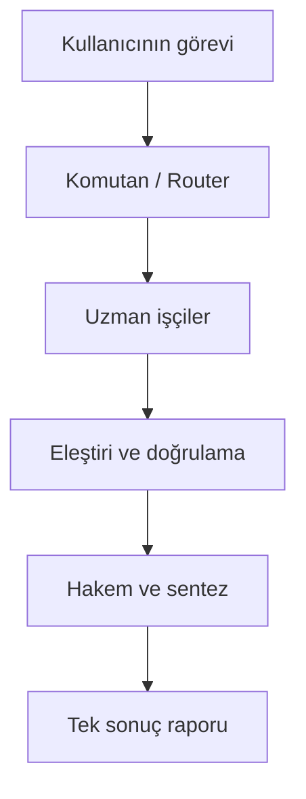

# VOLTRAN

**Birden fazla yapay zekâ modelini, tek bir görevin uzman parçaları olarak birleştiren yerel orkestrasyon sistemi.**

VOLTRAN; kullanıcıdan tek bir görev alır, görevi uygun uzmanlara böler, sonuçları kontrollü turlarla karşılaştırır ve tek bir denetlenebilir cevap üretir. Amaç, üç modele aynı soruyu sorup üç ayrı cevap göstermek değil; her modeli gerçekten katkı sağlayacağı yerde kullanmaktır.

## Projenin amacı

- GPT/Codex, Claude ve Gemini ailesini ortak bir görev akışında çalıştırmak.
- Basit işleri hızlı modellere, zor işleri güçlü modellere yönlendirmek.
- Modellerin birbirlerinin sonuçlarını inceleyebilmesini sağlamak.
- Çelişkileri, kaynakları ve güven düzeyini son raporda göstermek.
- Kullanıcının mevcut ChatGPT Plus, Claude Pro ve Google AI Pro erişimlerinden mümkün olduğunca yararlanmak.
- Kullanıcının açık onayı olmadan ücretli API kullanımına geçmemek.

## Temel çalışma biçimi



### Roller

| Rol | Sorumluluk |
| --- | --- |
| Komutan | Görevi anlamak, parçalamak, risk ve hassasiyet düzeyini belirlemek |
| Router | Uygun sağlayıcıyı/modeli yetenek, süre ve kota durumuna göre seçmek |
| Uzman işçi | Kodlama, araştırma, belge analizi, görsel inceleme veya rutin alt görevi yürütmek |
| Eleştirmen | Hataları, eksikleri, çelişkileri ve dayanaksız iddiaları bulmak |
| Hakem | Aday sonuçları karşılaştırmak ve anlaşmazlıkları çözmek |
| Raportör | Ortak sonucu, belirsizlikleri ve kaynakları tek çıktıda sunmak |

Model adları rollere kalıcı olarak kilitlenmez. Örneğin Claude çoğu kod görevinde güçlü bir aday olabilir; ancak router görev tipine, mevcut model sürümüne, bağlama ve yapılan ölçümlere göre seçim yapar.

## Çalışma modları

### `quick` — Voltran Hızlı

Tek ana model ve gerekirse bir hızlı yardımcı kullanır. Küçük kod değişiklikleri, özetleme, sınıflandırma ve biçimlendirme için.

### `expert` — Voltran Uzman

Komutan, göreve en uygun bir veya iki uzmanı çağırır. Kodlama, teknik teşhis ve kapsamlı belge analizi için varsayılan mod.

### `council` — Voltran Konsey

Birden fazla sağlayıcı bağımsız çözüm üretir; ardından eleştiri ve hakem turu yapılır. Finans, önemli kararlar, mimari tasarım ve yüksek doğruluk gereken işler için.

### `visual` — Voltran Görsel

Metin ekibi görsel brifi hazırlar; uygun görsel sağlayıcısı üretim veya düzenleme yapar. Bu mod, ilgili sağlayıcının kullanılabilir görsel aracına göre etkinleşir.

## İlk sürümün kapsamı (MVP)

1. macOS Apple Silicon üzerinde çalışan `voltran` komutu.
2. Resmî CLI adaptörleri:
   - Codex: `codex exec`
   - Claude Code: `claude -p`
   - Google Antigravity CLI: `agy -p`
3. Sağlayıcı erişilebilirlik ve oturum kontrolü.
4. `quick`, `expert` ve `council` modları.
5. Paralel alt görev çalıştırma, zaman aşımı ve hata izolasyonu.
6. JSON tabanlı ortak görev/yanıt sözleşmesi.
7. Yerel SQLite çalışma geçmişi ve denetim kaydı.
8. Hassas veri uyarısı, sağlayıcı izin politikası ve isteğe bağlı maskeleme.
9. Tek Markdown sonuç raporu.

MVP’de masaüstü arayüzü, bulut sunucusu, otomatik API harcaması ve sınırsız ajan sohbeti bulunmayacak.

## Tasarım ilkeleri

- **Yerel öncelikli:** Orkestratör ve kayıtlar kullanıcının Mac’inde çalışır.
- **Abonelik öncelikli:** Önce resmî CLI oturumları; API anahtarları yalnızca ayrıca seçilirse.
- **Sağlayıcı bağımsız:** Çekirdek, tek bir modelin komut biçimine bağlı olmaz.
- **En az veri:** Her uzmana yalnızca ihtiyaç duyduğu bağlam gönderilir.
- **Açık izin:** Hassas belgelerin hangi sağlayıcılarla paylaşılacağı görünür ve kontrol edilebilir olur.
- **Sınırlı tartışma:** Varsayılan olarak en fazla bir çözüm ve bir eleştiri turu; sonsuz model konuşması yoktur.
- **Denetlenebilirlik:** Hangi görevin hangi modele neden verildiği kaydedilir.
- **Ölçülebilirlik:** Model seçimi kişisel kanaatten çok görev bazlı değerlendirmelerle iyileştirilir.

## Önerilen teknoloji yığını

- Python 3.11+
- `asyncio` ve güvenli alt süreç yönetimi
- Typer tabanlı CLI
- Pydantic tabanlı veri sözleşmeleri
- SQLite tabanlı yerel kayıt
- Pytest tabanlı testler
- Daha sonraki aşamada isteğe bağlı SwiftUI masaüstü arayüzü

Kesin paket sürümleri, ilk kurulum sırasında Mac’teki mevcut Python ve paket yöneticisi kontrol edildikten sonra kilitlenecektir.

## Planlanan komutlar

```bash
voltran doctor
voltran login codex
voltran login claude
voltran login google
voltran run --mode expert "Görev açıklaması"
voltran run --mode council --file belge.pdf "Belgeyi incele"
voltran history
voltran config
```

`voltran doctor`; işletim sistemi, mimari, gerekli CLI araçları, sürümler, oturumlar ve eksik bağımlılıklar için salt okunur kontrol yapacaktır. Kurulum veya değişiklik yapmadan önce uygulanacak işlemleri kullanıcıya gösterecektir.

## Geliştirme kurulumu

```bash
uv sync --extra dev
uv run voltran doctor
uv run pytest
```

Makinece okunabilir teşhis çıktısı için `uv run voltran doctor --json`, oturum
kontrollerini atlamak için `uv run voltran doctor --no-sessions` kullanılabilir.

## Güvenlik sınırı

VOLTRAN, bir dosyayı birden fazla sağlayıcıya gönderdiğinde veri fiilen birden fazla hizmetle paylaşılmış olur. Bu nedenle finansal, sağlıkla ilgili veya kimlik bilgisi içeren dosyalarda varsayılan politika şudur:

1. Hassas veri sınıflandırması yap.
2. Gereksiz kimlik alanlarını maskele.
3. Yalnızca gerekli parçaları seç.
4. Kullanılacak sağlayıcıları işlem öncesinde göster.
5. Kullanıcı onayı yoksa kapsamı genişletme.

Parolalar, oturum belirteçleri ve API anahtarları model istemlerine veya çalışma kayıtlarına yazılmaz.

## Yol haritası

- [x] Proje adı ve temel vizyon
- [x] İlk gereksinimlerin tanımlanması
- [x] Proje iskeleti ve test altyapısı
- [x] `voltran doctor`
- [x] Ortak sağlayıcı adaptör arayüzü
- [x] Codex, Claude ve Google Antigravity CLI adaptörleri
- [ ] Router ve çalışma modları
- [ ] Eleştiri/hakem akışı
- [ ] Gizlilik politikaları ve maskeleme
- [ ] Görev bazlı değerlendirme seti
- [ ] Paketleme ve tek komutluk macOS kurulumu
- [ ] İsteğe bağlı SwiftUI arayüz

## Resmî teknik dayanaklar

- [OpenAI — Subagents](https://learn.chatgpt.com/docs/agent-configuration/subagents)
- [OpenAI — Orchestration and handoffs](https://developers.openai.com/api/docs/guides/agents/orchestration)
- [OpenAI — Developer commands](https://learn.chatgpt.com/docs/developer-commands?surface=cli)
- [Anthropic — Claude Code CLI reference](https://code.claude.com/docs/en/cli-reference)
- [Google — Antigravity CLI](https://antigravity.google/product/antigravity-cli)
- [Google — Gemini CLI geçiş duyurusu](https://github.com/google-gemini/gemini-cli/discussions/28017)

## Durum

Proje başlangıç aşamasındadır. Bir sonraki hedef, proje iskeletini oluşturmak ve `voltran doctor` komutunu çalışan ilk uçtan uca parça olarak geliştirmektir.
