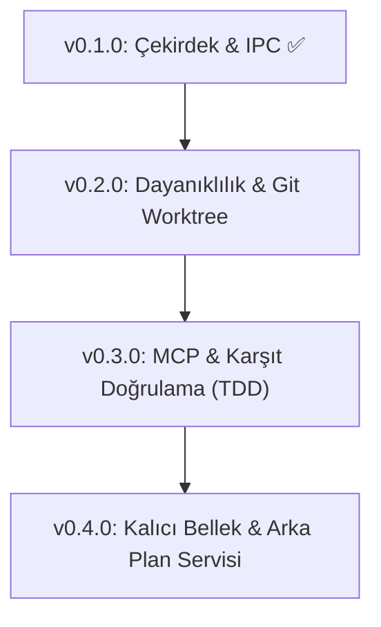

# VOLTRAN Stratejik ve Teknik Yol Haritası (Roadmap)

> **Mevcut Sürüm:** `v0.1.0`  
> **Odak:** Yerel çoklu model orkestrasyonunu deneysel bir prototipten, günlük yazılım geliştirme süreçlerinde güvenle kullanılan endüstriyel bir geliştirici aracına dönüştürmek.

---

## 🔍 Gerçekçi Durum Tespiti ve Temel Riskler

Voltran şu an yerel PTY oturumları üzerinden çalışan, temel uzlaşma ve güvenlik mekanizmalarına sahip işlevsel bir çekirdeğe sahiptir. Ancak projenin tam anlamıyla bir "günlük sürücü" (daily driver) olabilmesi için çözülmesi gereken gerçek teknik engeller şunlardır:

1. **CLI / PTY Kırılganlığı:** Model CLI'larının (Codex, Claude Code, AGY) sürümleri değiştikçe ekran çıktıları, onay pencereleri veya PTY sinyalleri değişebilir. Sistem salt ekran kazımaya (screen scraping) değil, yapılandırılmış IPC kanallarına dayanmalıdır.
2. **Bağlam ve Jeton (Token) Şişmesi:** 3 model birbirine sürekli yanıt verdikçe transkript karesel (quadratic) olarak büyür. Akıllı bağlam budama ve tur bazlı özetleme şarttır.
3. **Saatlik Kota ve Oturum Sınırları:** Tüketici abonelikleri (Plus, Pro) agresif saatlik limitlere sahiptir. Sistem, kota dolduğunda oturumu askıya alıp (checkpointing) kota açıldığında kaldığı yerden devam edebilmelidir.
4. **Çalışma Alanı Güvenliği:** Modeller kod yazarken geliştiricinin kirli (uncommitted) çalışma ağacını ezmemeli; yalıtılmış `git worktree` alanlarında çalışmalıdır.

---

## 🗺️ Fazlar ve Sürüm Planı



---

### 📦 v0.1.0 — Temel Altyapı ve Kararlı Çekirdek (TAMAMLANDI ✅)
- [x] Resmî CLI adaptörleri (`codex`, `claude`, `agy`)
- [x] `hcom` PTY tabanlı IPC ve canlı süreç yönetimi
- [x] Quorum, uzlaşma ve gözetmen döngüsü (`CollaborationSupervisor`)
- [x] Karpathy esintili kör hakemlik protokolü (`--blind`)
- [x] Forge esintili hafif dosya kilitleme motoru (`FileLockManager`)
- [x] Görev bazlı kıyaslama ve değerlendirme paketi (`voltran bench`)
- [x] Rich tabanlı tam ekran canlı gösterge paneli (`voltran dashboard`)
- [x] SQLite yerel denetim geçmişi ve veri sanitizasyonu (`voltran history`)
- [x] Python 3.11 - 3.14 çapraz platform CI matrisi (macOS & Ubuntu)
- [x] macOS tek komutluk kurulum aracı (`scripts/install.sh`)

---

### 🛡️ v0.2.0 — Dayanıklılık, Oturum İyileştirme ve Git İzolasyonu (Sıradaki Adım)

#### 1. Yalıtılmış Git Çalışma Alanı (`git worktree` İzolasyonu)
* **Problem:** `--write` izni verildiğinde modeller geliştiricinin üzerinde çalıştığı aktif dosyalarda çakışma yaratabilir.
* **Çözüm:** Voltran, her görev için geçici bir `git worktree` (`.voltran/worktrees/<run_id>`) açar.
* Modeller orada çalışır, testler orada koşar. Görev başarıyla onaylandığında ana dala `git merge` veya `git diff` yaması olarak uygulanır.

#### 2. Kota Dondurma ve Askıya Alma (Checkpointing / Resume)
* Model saatlik limite takıldığında oturumu iptal etmek yerine oturum durumunu SQLite'a dondurur.
* Kota sıfırlandığında `voltran resume <run_id>` ile tartışma kaldığı yerden devam eder.

#### 3. Tek Noktadan Oturum Açma (`voltran login`)
* Kullanıcının ayrı ayrı CLI komutlarıyla uğraşması yerine, eksik oturumları tespit edip sırayla yetkilendirme ekranlarını açan orkestratör komutu:
  ```bash
  voltran login --status
  voltran login --all
  ```

#### 4. Otomatik PR İncelemesi (`voltran review`)
* Mevcut daldaki değişiklikleri (`git diff`) modellerin uzmanlıklarına göre paylaştırır:
  * **Codex:** Algoritma karmaşıklığı ve kod kalitesi.
  * **Claude:** Güvenlik açıkları, sınır durumlar (edge-cases) ve yetkilendirme riskleri.
  * **Antigravity:** Mimari bütünlük ve test kapsamı.
* Çıktı: GitHub PR'ına doğrudan yapıştırılabilir Markdown inceleme raporu.

---

### ⚙️ v0.3.0 — Ortak Araçlar (MCP) ve Karşıt Doğrulama (Adversarial TDD)

#### 1. MCP (Model Context Protocol) Desteği
* Üç modele de standartlaştırılmış JSON-RPC protokolüyle yerel araç sağlama:
  * Dosya okuma/yazma, bash komutu çalıştırma, SQLite/PostgreSQL sorgulama.
  * Modellerin kendi özel CLI komutlarına bağımlı kalmadan aynı standart araç havuzunu kullanması.

#### 2. Karşıt Test Güdümlü Geliştirme (Adversarial Coding Loop)
* **Döngü:**
  1. *Model A (Mimar/Geliştirici):* Fonksiyonu yazar.
  2. *Model B (Kırıcı/Testçi):* Kodu patlatmayı hedefleyen sınır durum testleri (`pytest`) yazar.
  3. Kod testleri geçene kadar modeller kendi aralarında düzeltme turlarına girer (azami 3 tur).
* Bu yaklaşım halüsinasyon riskini neredeyse sıfıra indirir.

#### 3. Transkript ve Jeton Optimizasyonu (Smart Context Compactor)
* Tartışma turları uzadığında ara mesajları sıkıştıran ve sadece kritik itiraz/mutabakat noktalarını sonraki tura aktaran dinamik bağlam sıkıştırıcı.

---

### 🧠 v0.4.0 — Kalıcı Proje Belleği ve Arka Plan Servisi

#### 1. Proje Düzeyinde Kalıcı Bellek (`.voltran/memory/`)
* Projenin kodlama standartlarını, kullanılan kütüphaneleri ve geçmiş kararları vektör veya yapılandırılmış JSON formatında saklama.
* Modellerin her çalıştırmada projeyi sıfırdan analiz etmek yerine önceki oturumların birikiminden faydalanması.

#### 2. macOS Status Bar / Menü Çubuğu Ajanı
* Terminal dışında çalışmak isteyenler için:
  * Menü çubuğunda anlık model kota durumu (yeşil/kırmızı gösterge).
  * Kısayol tuşuyla (`Cmd + Shift + V`) hızlı soru sorma ve konsey çağırma kutusu.
  * Konsey uzlaşmaya vardığında macOS yerel bildirimi.

---

## 📈 Metrikler ve Başarı Kriterleri

| Metrik | Hedef | Ölçüm Yöntemi |
| :--- | :--- | :--- |
| **Uzlaşma Başarısı** | > %85 | Konsey oturumlarının `VOLTRAN_CONSENSUS` ile sonuçlanma oranı |
| **Halüsinasyon Azaltma** | Tek modele kıyasla < %5 | Karşıt doğrulama testlerinin tespit ettiği mantık hatası oranı |
| **Ortalama Konsey Süresi** | < 45 saniye | 3 modelli istişarelerin tamamlanma süresi |
| **Test Kapsamı** | > %90 | Pytest kod satırı kapsama oranı |
